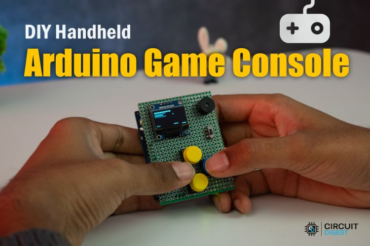
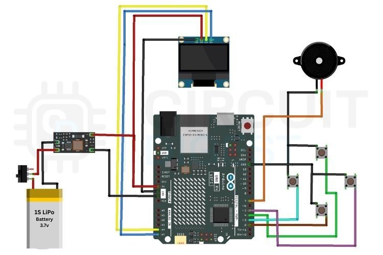
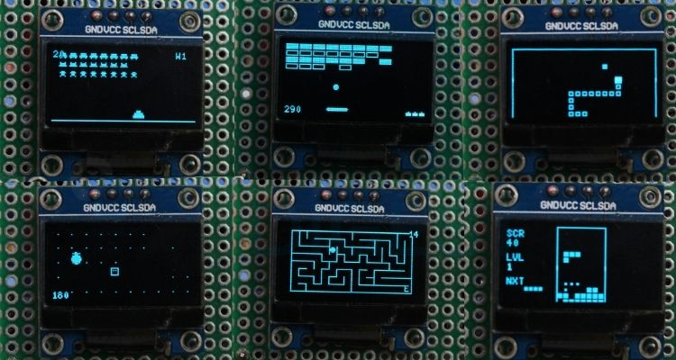

# DIY Handheld Arduino Game Console

A compact, portable retro gaming console built using an **Arduino UNO R4 (WiFi or Minima)**. This project features **10 classic arcade games** written from scratch in Arduino C++, complete with a 0.96" OLED display, button controls, and sound effects.

For a detailed step-by-step build guide, circuit diagrams, and code explanation, check out the full article on **Circuit Digest**:
👉 [**DIY Handheld Arduino Game Console with 10 Retro Games**](https://circuitdigest.com/microcontroller-projects/handheld-arduino-game-console)

---

## 🎮 Games Included
The console comes pre-loaded with 10 retro-style games, each optimized for the 128x64 OLED display:
1.  **Asteroids** – Navigate and destroy space rocks.
2.  **Breakout** – Classic paddle and ball brick-breaking action.
3.  **Dino Run** – Skip over obstacles in this endless runner.
4.  **Flappy Bird** – Avoid pipes with perfectly timed flaps.
5.  **Maze Runner** – Find your way through randomly generated mazes.
6.  **Pacman** – Eat dots and avoid ghosts in the classic maze.
7.  **Pong** – The original table tennis simulation.
8.  **Snake** – Grow as long as possible without hitting walls or yourself.
9.  **Space Invaders** – Defend Earth from waves of alien invaders.
10. **Tetris** – Stack blocks and clear lines in this iconic puzzle game.

---

## 🛠️ Hardware Requirements
To build this console, you will need the following components:
- **Microcontroller**: Arduino UNO R4 (WiFi or Minima)
- **Display**: 0.96" SSD1306 I2C OLED (128x64)
- **Controls**: 4x Tactile Push Buttons (Up, Down, Left, Right)
- **Audio**: Active Buzzer
- **Power**: 3.7V LiPo Battery + 5V Boost Converter (for portability)
- **Misc**: Perfboard (HAT style), Female header strips, Connecting wires.

---

## 🔌 Pin Configuration
| Component | Arduino Pin | Description |
| :--- | :--- | :--- |
| **OLED SDA** | A4 | I2C Data |
| **OLED SCL** | A5 | I2C Clock |
| **BTN_UP** | 4 | Up Navigation |
| **BTN_DOWN** | 2 | Down Navigation |
| **BTN_LEFT** | 3 | Left Navigation |
| **BTN_RIGHT** | 5 | Right / Select / Flap |
| **Buzzer** | 7 | Sound Effects |

### Wiring Diagram

---

## 🚀 How to Use
1.  **Assembly**: Connect the components according to the wiring diagram or mount them on a custom HAT for the Arduino R4.
2.  **Libraries**: Install the **U8g2** library via the Arduino Library Manager.
3.  **Upload Code**: Open `arduino_gaming_console.ino` in the Arduino IDE and upload it to your board.
4.  **Navigate**: Use the **UP** and **DOWN** buttons to scroll through the game menu.
5.  **Select**: Press **LEFT** or **RIGHT** to start the highlighted game.
6.  **Play**: Enjoy 10 classic retro games on your handheld console!

---

## 📺 Demonstration

---

## 🔗 Project Insights
For more details on the hardware assembly, code breakdown, and library compatibility, visit:
[**Circuit Digest Build Guide**](https://circuitdigest.com/microcontroller-projects/handheld-arduino-game-console)
